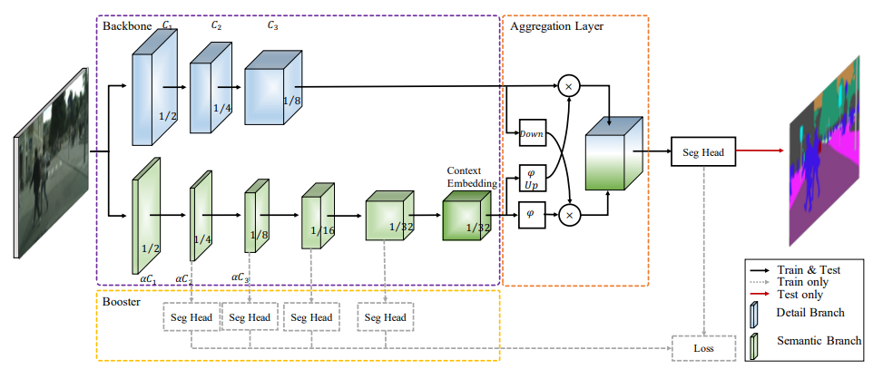

# BiSeNetV2 (2020) 
Link to the paper -> [Link](https://arxiv.org/pdf/2004.02147.pdf) 

## Features

- End to end trainable
- Real-time semantic segmentation
- ...
- ...
- ...

## Architecture



img credits: https://arxiv.org/pdf/2004.02147.pdf

## Training

- **Dataset:**
    - SBD dataset is used for training.
    - PascalVoc11 (excluding samples used in the training split of SBD) is used for validation, ignoring the border (255 or class 21).
    - The input is in the RGB format and is centered using channel means (0.485, 0.456, 0.406) and scaled in [0 - 1] range using std (0.229, 0.224, 0.225).

- **Pretrained weights:**
    - Imagenet pretrained weights are used as starting point for the Semantic Segmentation task  

- **Training Procedure:**
    - Training configuration (RTX-3090 Ti):
        - Batch size: 32
        - Images not resized, random crop of 320x320 (Padding is used for image with shorter dimensions) 
        - Loss is averaged due to the fact that we have same shape during training
        - SGD optimizer with:
            - Momentum: 0.9 
            - Weight decay: 5e-04
        - PolyDecay policy for learning rate with:
            - starting lr: 1e-02
            - power: 0.9
- **Augmentation:**
    - Light Augmentation was used during training:
        ```python
        A.HorizontalFlip(),
        A.VerticalFlip(),
        A.RandomBrightnessContrast(),
        A.RandomScale([-0.5,1],always_apply=True),
        A.PadIfNeeded(min_height=320,min_width=320,border_mode=cv2.BORDER_CONSTANT),
        A.RandomCrop(320,320)
        ```
         
## Results

|**Model**|**Ref**|**Pretrained**|**Epochs**|**Iterations**|**mIoU**|**Accuracy**|**Weights**|
|---|---|---|---|---|---|---|---|
|**BiSeNetV2**| paper | ImageNet | - | - | - | - | [[weights]()]|
|**BiSeNetV2**| mine | ImageNet | - | - | - | - |[[weights]()]|
