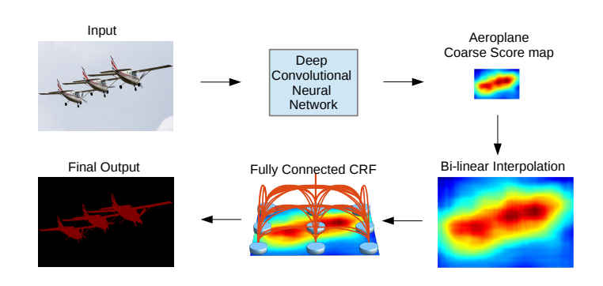

# DeepLab (2014)

Link to the paper -> [Link](https://arxiv.org/pdf/1412.7062v4.pdf) 

## Features

- End to end trainable
- Piecewise training for DCNN and CRF
- Inference time during testing is 8frame per second
- Used Atrous Special Pyramid Pooling module for aggregating multi-scale features

## Architecture

img credits: https://arxiv.org/pdf/1412.7062v4.pdf

## Training

- **Dataset:**
    - SBD dataset is used for training.
    - PascalVoc11 (excluding samples used in the training split of SBD) is used for validation, ignoring the border (255 or class 21).
    - The input is in the BGR format and is centered using channel means [103.949, 116.799, 123.68]. The scale is [0 - 255], not [0 - 1].

- **VGG16 pretrained weights:**
    - Caffe pretrained weights were used following the paper.
    - The weights of the last classification layer are discarded.
    - All other layer weights have been transferred, including the linear layer weights, but reshaped accordingly.

- **Training Procedure:**
    - The training follows the Heavy training procedure outlined in the original paper:
        - Batch size: 
        - Images size:
   
- **Augmentation:**
    - 