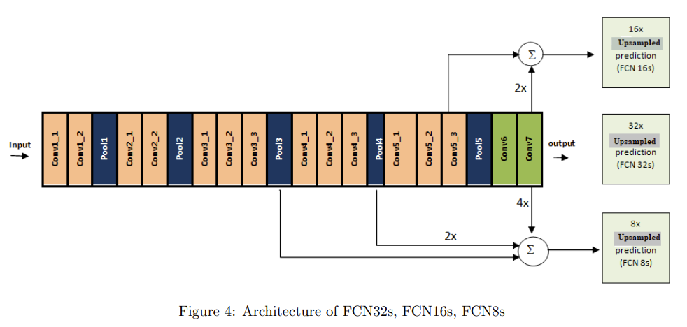

# FCN-VGG16 (2014)

Link to the paper -> [Link](https://arxiv.org/pdf/1605.06211.pdf) 

## Features

- End to end trainable
- Dropout is used to reduce overfitting

## Architecture

img credits: https://arxiv.org/pdf/2001.04074.pdf

## Training

- **Dataset:**
    - SBD dataset is used for training.
    - PascalVoc11 (excluding samples used in the training split of SBD), ignoring the border (255 or class 21).
    - The input is in the BGR format and is centered using channel means [103.949, 116.799, 123.68]. The scale is [0 - 255], not [0 - 1].

- **VGG16 pretrained weights:**
    - Caffe pretrained weights were used following the paper.
    - The weights of the last classification layer are discarded.
    - All other layer weights have been transferred, including the linear layer weights, but reshaped accordingly.

- **Training Procedure:**
    - The training follows the Heavy training procedure outlined in the original paper:
        - Batch size: 1
        - Images with original size
        - Loss is not averaged due to varying sizes during training; it is summed. Hence, the learning rate of 1e-10 for FCN32s, 1e-12 fpr FCN16s and 1e-14 for FCN8s.
        - Momentum: 0.99 (This value is chosen based on the relation between batch size and momentum. In the paper, a batch size of 20 with a momentum of 0.9 is considered for standard training. The equivalent momentum for a batch size of 1 is approximately 0.99 [0.9 * (1/20) ≈ 0.99]. Refer to the paper for more details.)
- **Augmentation:**
    - No augmentation was used as its inclusion did not yeld better results. 
         
## Results

|**Model**|**Ref**|**Epochs**|**Iterations**|**mIoU**|**Accuracy**|**Weights**|
|---|---|---|---|---|---|---|
|**FCN32s**| Paper | - | 100000 | 63.6 | 90.5 | [-]|
|**FCN32s**| mine | 12 | 100000 | 63.1 | 90.5 |[[weights](https://drive.google.com/file/d/14USyOwfhz0Hvfy6tRxmstBs83yIGz70Y/view?usp=sharing)]|
|**FCN16s**| Paper | - | - | 65.0 | 91.0 |[-]|
|**FCN16s**| mine | 9 | 76492 | 64.62 | 91.0 |[[weights](https://drive.google.com/file/d/1rIn-OFpyObVanKDQriZ7WxWoP_q3QBl_/view?usp=sharing)]|
|**FCN8s**| Paper | - | - | 65.5 | 91.2 |[-]|
|**FCN8s**| mine | - | - | - | - |[[weights]()]|