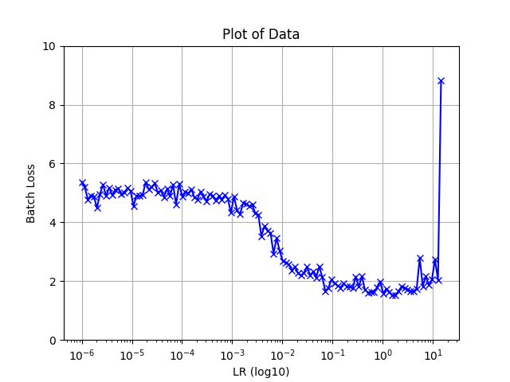

# U-NET (2015) [Different implementation from Paper]

Link to the paper -> [Link](https://arxiv.org/pdf/1505.04597.pdf) 

## Features

- End to end trainable
- Dropout is used to reduce overfitting
- Difference from the original paper:
    - The input and output have the same shape, in the original architecture no padding is used in the convolution layer.
    - Use of BatchNorm2D after each Convolution Layer
    - Use of BilinearUpsampling + 1x1 Convolution instead of ConvTranspose2d

## Architecture


img credits: https://arxiv.org/pdf/1505.04597.pdf

## Training

- **Dataset:**
    - SBD dataset is used for training.
    - PascalVoc11 (excluding samples used in the training split of SBD) is used for validation, ignoring the border (255 or class 21).
    - The input is in the RGB format and is centered using channel means (0.485, 0.456, 0.406) and scaled in [0 - 1] range using std (0.229, 0.224, 0.225).

- **Pretrained weights:**
    - Since the architecture differed from what was described in the paper, I ran some tests without using a pre-trained model. 
    After, I gave training the downsampling part a shot using the ImageNet Dataset. After letting it run for 35 epochs, each taking over an hour, I decided to stop when the validation accuracy hit 0.6 (that's 60%). During this pretraining phase, I didn't use dropout or BatchNorm, so all that time feels like it went down the drain! :'(

- **Learning rate finder**
    - Based on fastAI implementation, I've performed LR-finder function to find the best LR to start with, here the plot of the result:

        

- **Training Procedure:**
    - Training configuration (RTX-3090 Ti):
        - Batch size: 32
        - Images not resized, random crop of 320x320 (Padding is used for image with shorter dimensions) 
        - Loss is averaged due to the fact that we have same shape during training
        - SGD optimizer with:
            - Momentum: 0.9 
            - Weight decay: 5e-04
        - PolyDecay policy for learning rate with:
            - starting lr: 1e-02
            - power: 0.9

- **Augmentation:**
    - Light Augmentation was used during training:
        ```python
        A.HorizontalFlip()
        A.RandomBrightnessContrast()
        A.Rotate((-20,20),border_mode=cv2.BORDER_CONSTANT)
        ```
         
## Results

|**Model**|**Ref**|**Pretrained**|**Epochs**|**Iterations**|**mIoU**|**Accuracy**|**Weights**|
|---|---|---|---|---|---|---|---|
|**U-NET**| Paper | - | - | - | - | - | [-]|
|**U-NET**| mine | ImageNet (Not completed) | - | - | - | - |[[weights]()]|

## Note:
- 