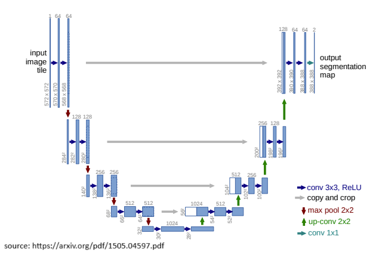

# U-NET (2015) [Different implementation from Paper]

Link to the paper -> [Link](https://arxiv.org/pdf/1505.04597.pdf) 

## Features

- End to end trainable
- Dropout is used to reduce overfitting
- The input and output in my implementation have the same shape, in the original architecture no padding is used in the convolution layer.

## Architecture

img credits: https://arxiv.org/pdf/1505.04597.pdf

## Training

- **Dataset:**
    - SBD dataset is used for training.
    - PascalVoc11 (excluding samples used in the training split of SBD) is used for validation, ignoring the border (255 or class 21).
    - The input is in the BGR format and is centered using channel means [103.949, 116.799, 123.68]. The scale is [0 - 255], not [0 - 1].

- **No pretrained weights:**
    - Since the arch is different from the paper implementation, I did some test with no pretrained architecture.

- **Training Procedure:**
    - The training follows the Heavy training procedure outlined in the original paper:
        - Batch size: 16
        - Images resized to 512x512 and random crop of 320x320
        - Loss is averaged due to the fact that we have same shape during training
        - Momentum: 0.9 with weight decay equal to 5e-04 and learning-rate equal to 1e-03
- **Augmentation:**
    - Augmentation was used during training. 
         
## Results

|**Model**|**Ref**|**Pretrained**|**Epochs**|**Iterations**|**mIoU**|**Accuracy**|**Weights**|
|---|---|---|---|---|---|---|---|
|**U-NET**| Paper | - | - | - | - | - | [-]|
|**FCN32s**| mine | - | - | - | - | - |[[weights]()]|
